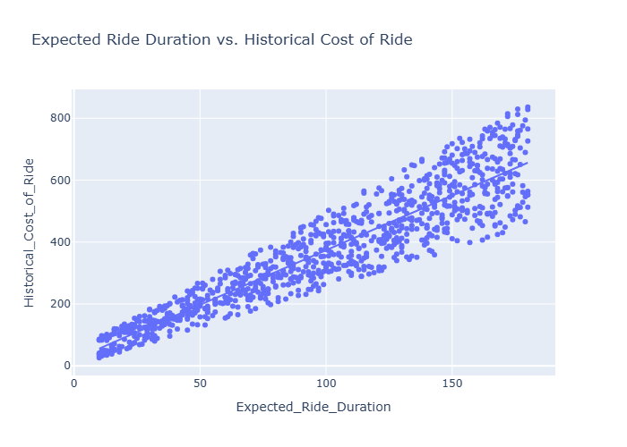
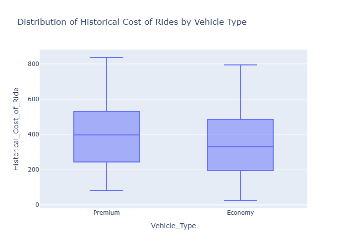
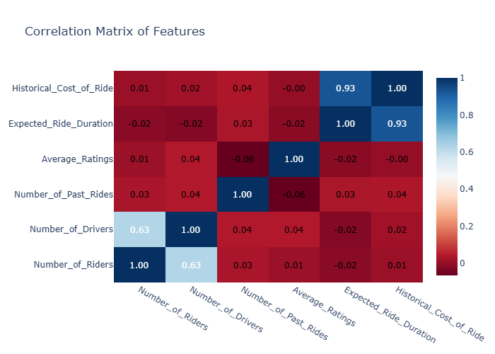

# Dynamic Pricing Implementation

## Overview
I want to learn about **Dynamic Pricing**. First, this project is a case study with purpose of learning, then I try to develope it to become a **Price Recommendation System**.
This project implements a dynamic pricing algorithm for ride-sharing services, analyzing demand and supply patterns to optimize pricing strategies. Then being used to build a predictive model for price recommendation.

### What is Dynamic Pricing? Why is it necessary?

## Data Analysis Visualizations(**[View Interactive Plots →](https://NguyenThuan-data.github.io/Dynamic_Pricing_Strategy/)**)

### 1. Ride Duration vs Cost Analysis

*This scatter plot shows the relationship between expected ride duration and historical cost, with a trend line indicating the correlation.*
*Insights:* We can see that the relationship between the expected duration with the cost the positvely increasing with very few dots far from the trend line. This suggest the duration is a good prediction factor of cost.

### 2. Vehicle Type Cost Distribution

*Box plot comparing cost distributions between Economy and Premium vehicle types.*

### 3. Feature Correlation Matrix

*This heatmap visualizes the correlations between all numeric features in the dataset, helping to identify which features most strongly influence the historical cost of rides.*
*Insight:* Use this matrix to select the features that have the highest correlation with historical cost, which is expected ride duration, for further analysis and model building

### Conclusion:
With the outcome, the company shows that the company only take expected ride duration for determine the cost and we can use that for dynamic pricing implementation. 

## Dynamic Pricing Implementation

### Complete Workflow:
1. Calculate raw multipliers from demand/supply data
2. Apply safety thresholds to prevent extremes
3. Multiply with base price to get final dynamic price
4. Result: Smart, balanced dynamic pricing! 🎯

### Key Components:
- **Demand Multiplier**: Uses 75th and 25th percentiles to categorize demand levels
- **Supply Multiplier**: Monitors driver availability patterns
- **price adjustment factors(Thresholds)**: Prevents extreme price fluctuations (20% max change)
- **Adjusted Price Cost**: Real-time price adjustments based on market conditions

## Predictive Model:

## Result
### Business Benefits:
- Increased revenue during high demand periods
- Competitive pricing during low demand
- Customer satisfaction through reasonable pricing
- Driver retention through stable earnings
