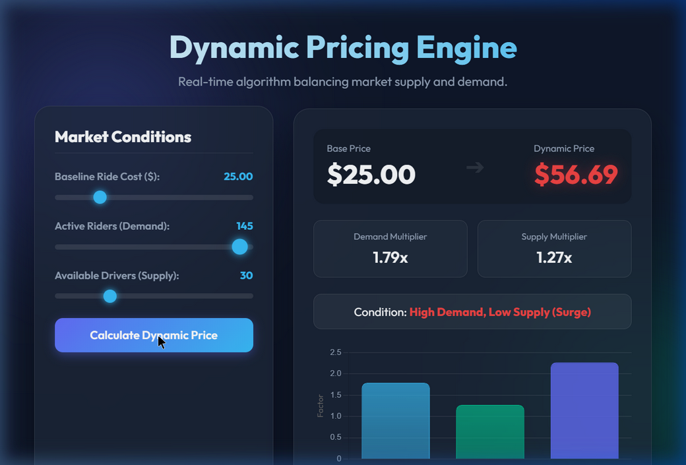

# Dynamic Pricing Strategy — Portfolio Case Study

[](https://fastapi.tiangolo.com/)
[](https://www.python.org/)

> Ride-sharing dynamic pricing: from Jupyter analysis to an isolated pricing engine and FastAPI product.

---

## Why I built this

Static ride prices fail when demand and supply diverge — riders wait, drivers idle, and revenue leaks. I wanted to turn a data-science case study into something that **behaves like a product**: testable math, an API, and a UI a reviewer can click.

## The challenge

- **Modeling:** Baselines from dataset percentiles (25th / 75th) had to become runtime rules, not notebook cells.
- **Architecture:** Mixing pricing math inside HTTP handlers would be untestable — I needed a clean split.
- **Demos:** This repo has **two demo surfaces** (see below) — easy to confuse if not documented honestly.

## What I did

1. Explored historical ride data in `dynamic_pricing.ipynb` (percentiles, surge patterns).
2. Extracted logic into **`pricing_engine.py`** — demand/supply multipliers + **0.8x price floor**.
3. Built **FastAPI** (`main.py`) + interactive dashboard (`templates/`, `static/`).
4. Published **static plot gallery** on GitHub Pages for quick visual review.

## What I learned

- Business rules belong in a **pure Python module** — the API should only orchestrate.
- A price floor (never below 80% of base) is a product decision, not a ML metric.
- Recruiters need to know **which demo to open** — static plots vs live API are different experiences.

## How this leveled me up

| | |
|---|---|
| **Before** | I stopped at notebook conclusions and charts |
| **After** | I can ship testable business logic + HTTP API + frontend |
| **Unlocked next** | FastAPI service design for larger pipelines (e.g. medical ASR internship project) |

## Demo / proof

| Demo | URL / command | What you see |
|------|---------------|--------------|
| **Static plots (no install)** | [nguyenthuan-data.github.io/Dynamic_Pricing_Strategy](https://nguyenthuan-data.github.io/Dynamic_Pricing_Strategy/) | Interactive plot iframes from analysis |
| **Live API + dashboard (local)** | `uvicorn main:app --reload` → [http://127.0.0.1:8000](http://127.0.0.1:8000) | Sliders, Chart.js, surge pricing in real time |
| **Swagger docs** | [http://127.0.0.1:8000/docs](http://127.0.0.1:8000/docs) | API contract |



---

## Technical reference

### Business problem

In ride-sharing, static pricing leads to lost revenue and poor UX when demand and supply diverge. This engine calculates **dynamic multipliers** from rider/driver counts vs historical baselines.

### Pricing rules (`pricing_engine.py`)

1. **Demand factor:** `Current Riders / Baseline Riders`
2. **Supply factor:** `Baseline Drivers / Current Drivers`
3. **Safety floor (0.8x):** Price never drops below 80% of standard cost
4. **Final cost:** `Base Cost × max(Demand, 0.8) × max(Supply, 0.8)`

Baselines use 25th and 75th percentiles from `dataset/dynamic_pricing.csv`.

### Run locally

```bash
git clone https://github.com/NguyenThuan-data/Dynamic_Pricing_Strategy.git
cd Dynamic_Pricing_Strategy
python -m venv venv
source venv/Scripts/activate  # Windows: venv\Scripts\activate
pip install -r requirements.txt
uvicorn main:app --reload
```

### Repository structure

```text
Dynamic_Pricing_Strategy/
├── main.py
├── pricing_engine.py
├── dataset/dynamic_pricing.csv
├── static/
├── templates/
└── dynamic_pricing.ipynb
```

### Tech stack

FastAPI · Uvicorn · Pandas · NumPy · HTML/CSS/JS · Chart.js
